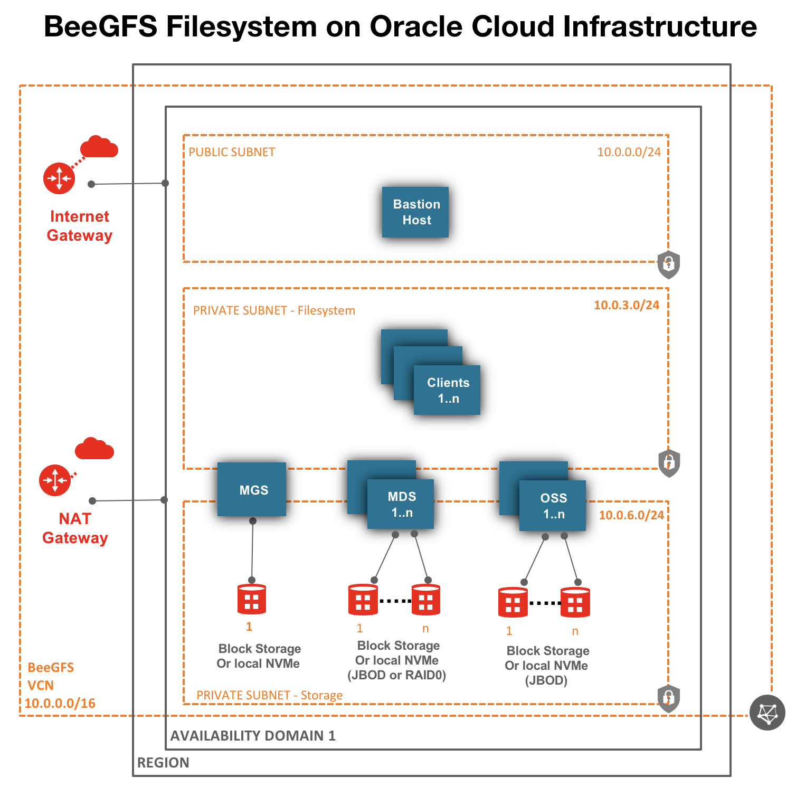
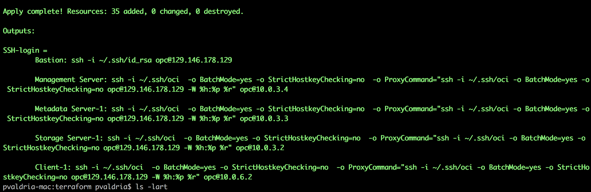

# oci-beegfs
Terraform modules that deploy [BeeGFS](https://www.beegfs.io/content/) on [Oracle Cloud Infrastructure (OCI)](https://cloud.oracle.com/en_US/cloud-infrastructure).

## BeeGFS License 
BeeGFS requires license, reach out to [thinkparQ](https://thinkparq.com/) for license details.   This github code is open source and its users responsibility to get the required license.  

## High Level Architecture 

## Prerequisites
First off you'll need to do some pre deploy setup.  That's all detailed [here](https://github.com/oracle/oci-quickstart-prerequisites).

## Clone the Terraform template
Now, you'll want a local copy of this repo.  You can make that with the commands:

    git clone https://github.com/oracle-quickstart/oci-beegfs.git
    cd oci-beegfs/terraform
    ls

## Update variables.tf file 
Update the variables.tf to change compute shapes, block volumes, etc. 

## Deployment and Post Deployment
Deploy using standard Terraform commands

        terraform init
        terraform plan

Pass ad_number=2, if you want to deploy to Availability-Domain-3. similarly use 0 for AD-1, 1 for AD-2. 

        terraform apply -var="ad_number=2"
        

## Contributing

This project welcomes contributions from the community. Before submitting a pull request, please [review our contribution guide](./CONTRIBUTING.md)

## Security

Please consult the [security guide](./SECURITY.md) for our responsible security vulnerability disclosure process

## License

Copyright (c) 2019 Oracle and/or its affiliates.

Released under the Universal Permissive License v1.0 as shown at
<https://oss.oracle.com/licenses/upl/>.
